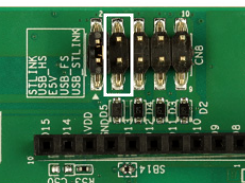
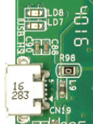
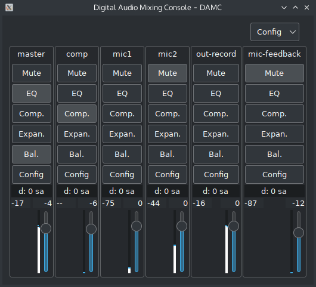

# usb_audio_loopback_stm32f723disco
Use a 32F723EDISCOVERY eval board as a USB audio soundcard with parametric EQ, compressor and expander.

This project allow the use of a 32F723EDISCOVERY eval board as a soundcard with additional post processing.

The audio path is like this:

# Usage

To do this, you must do the following:

- Flash this firmware to a [32F723EDISCOVERY eval board](https://www.st.com/en/evaluation-tools/32f723ediscovery.html):
  - With STLINK Mass storage drag'n drop:
    - Download [`damc_stm32f723disco-vX.Y.Z-stlink_dragdrop.zip`](https://github.com/amurzeau/usb_audio_loopback_stm32f723disco/releases)
    - Copy either `damc_stm32f723disco.hex` or `damc_stm32f723disco.bin` to the USB Mass storage device
    - This will flash your board
  - With [STM32CubeProgrammer](https://www.st.com/en/development-tools/stm32cubeprog.html#get-software):
    - Download [`damc_stm32f723disco-vX.Y.Z-stm32cubeprogrammer.zip`](https://github.com/amurzeau/usb_audio_loopback_stm32f723disco/releases)
    - Flash the board using [STM32CubeProgrammer](https://www.st.com/en/development-tools/stm32cubeprog.html#get-software) and `damc_stm32f723disco.elf`
- Power-up and connect the board using USB
  - Switch the power supply from STLINK USB cable to the USB HS cable by putting the jumper on USB HS on CN8 connector (under the board)
  - 
  - Connect a micro-USB cable to the USB HS connector of the eval board:
  - 
- Download damc-gui for your platform (Windows 32 bits / 64 bits or Linux)
  - Run `damc_gui_serial.bat` to run `damc-gui` and control the board via its serial port
  - You should get something like this:
    

2 audio outputs and 1 audio inputs should appear in Windows.

The supported audio format is 48000 Hz, Stereo, 16 bits.

For each strip, audio is processed in this order:
- Equalizers
- Expander
- Compressor
- Volume
- Peak meter take the audio levels here
- Mute
